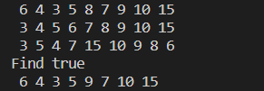
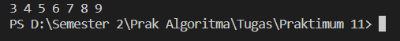
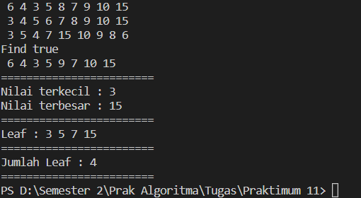
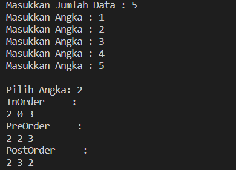

**Algoritma dan Struktur Data 2021-2022** 

**Nama : Andhito Galih Nur Cahyo**

**Kelas : 1F**

**No absen : 06**

**Nim : 2141720138**

**JOBSHEET XIII**

**TREE**

**1.  Tujuan Praktikum** 

Setelah melakukan praktikum ini, mahasiswa mampu:  

   1. memahami model *Tree* khususnya *Binary Tree* 
   2. membuat dan mendeklarasikan struktur algoritma *Binary Tree*. 
   3. menerapkan dan mengimplementasikan algoritma *Binary Tree* dalam kasus *Binary Search Tree* 

**2.  Praktikum** 

**2.1 Implementasi Binary Search Tree menggunakan Linked List** 

**2.1.1 Tahapan percobaan** 

**Amati hasil running tersebut.** 



**2.1.2 Pertanyaan Percobaan** 

1. Mengapa  dalam  binary  search  tree  proses  pencarian  data  bisa  lebih  efektif dilakukan dibanding binary tree biasa?

2. Untuk apakah di class **Node**, kegunaan dari atribut **left** dan **right**?

3. a. Untuk apakah kegunaan dari atribut **root** di dalam class **BinaryTree**?

 b. Ketika objek tree pertama kali dibuat, apakah nilai dari **root**?

4. Ketika tree masih kosong, dan akan ditambahkan sebuah node baru, proses apa yang akan terjadi?

5. Perhatikan method **add()**, di dalamnya terdapat baris program seperti di bawah ini. Jelaskan secara detil untuk apa baris program tersebut?

   ```
   if(data < current.data){
      if(current.left != null){
         current = current.left;
      }else{
         current.left = new Node(data);
         break;
      }
   }
   ```

**Jawab:** 

1. Binary  search  tree  proses  pencarian  data  bisa  lebih  efektif dilakukan dibanding binary tree biasa karena dalam pencariannya binary search tree terdapat left-child itu harus lebih kecil dari pada right-child dan parent-nya. Karena hal tersebut dapat mempermudah dalam pencarian.

2. Pada class **Node** terdapat atribut left dan right, jika atribut left digunakan untuk menyimpan indeks yang mengarah ke arah left-child (nilai yang lebih kecil dari pada root). Sedangkan atribut right digunakan untuk menyimpan indeks yang mengarah ke arah right-child (nilai yang lebih besar dari pada root).

3. a. untuk menyimpan data yang pertama kali masuk.
    
   b. nilai dari **root** ketika pertama kali dibuat ialah **null**

4. Proses yang akan terjadi ialah sebuah penambahan data atau memasukkan data (add).

5. Jika nilai dari data lebih kecil dari data terakhir (yang sudah ada) dan Jika current.left tidak bernilai null (ada isinya). Maka, nilai dari current adalah current sebelumnya (current.left)/current yang ada di sebelah kiri, bisa dikatakan juga bahwasanya current.left akan menjadi parent dari data yang baru dimasukkan. Sedangka, jika current.left bernilai null, maka current.left akan menyimpan data node baru/data yang baru dimasukkan akan menjadi current.left atau left-child.

**2.2 Implementasi binary tree dengan array**

**2.2.1  Tahapan Percobaan** 

**Jalankan class **BinaryTreeArrayMain** dan amati hasilnya!**



**13.2.1 Pertanyaan Percobaan** 

1. Apakah  kegunaan  dari  atribut  data  dan  idxLast  yang  ada  di  class **BinaryTreeArray**?

2. Apakah kegunaan dari method **populateData()**?

3. Apakah kegunaan dari method **traverseInOrder()**?

4. Jika suatu node binary tree disimpan dalam array indeks 2, maka di indeks berapakah posisi left child dan rigth child masin-masing?

5. Apa kegunaan statement int idxLast = 6 pada praktikum 2 percobaan nomor 4?

**Jawab:** 
1. Atribut **data** digunakan untuk menyimpan data array. Sedangkan atribut **idxLast** digunakan untuk menyimpan data batas index.

2. method yang berguna untuk menginisialisasi atribut data dan idxLast.

3. Digunakan untuk mencetak semua data yang ada di tree yang mana prosesnya ialah mengunjungi dan cetak seluruh data pada subtree sebelah kiri -> mengunjungi dan cetak data pada root -> mengunjungi dan cetak seluruh data pada subtree sebelah kanan.

4. Posisi left-child berada pada indeks ke-5 dan right-child berada pada indeks ke-6

5. Untuk menunjukkan bahwa batas indeks array adalah 6. 

**13.3 Tugas Praktikum**   

1. Buat method di dalam class **BinaryTree** yang akan menambahkan node dengan cara rekursif.** 

2. Buat method di dalam class **BinaryTree** untuk menampilkan nilai paling kecil dan yang paling besar yang ada di dalam tree.**

3. Buat method di dalam class **BinaryTree** untuk menampilkan data yang ada di leaf.**

4. Buat method di dalam class **BinaryTree** untuk menampilkan berapa jumlah leaf yang ada di dalam tree.

 **Jawab:**

-code

```
      public class Node {
    int data;
    Node left;
    Node right;

    public Node(){
    }

    public Node(int data){
       this.left = null;
       this.data = data;
       this.right = null;
    }
}
public class BinaryTree {
    Node root;

    public BinaryTree(){

    }

    boolean isEmpty(){
       return root == null;
    }

    // void add(int data){
    //     if(isEmpty()){
    //         root = new Node(data);
    //     }else{
    //         Node current = root;
    //         while(true){
    //             if(data < current.data){
    //                 if(current.left != null){
    //                     current = current.left;
    //                 }else{
    //                     current.left = new Node(data);
    //                     break;
    //                 }
    //             }else if(data > current.data){
    //                 if(current.right != null){
    //                     current = current.right;
    //                 }else{
    //                     current.right = new Node(data);
    //                     break;
    //                 }
    //             }else{
    //                 break;
    //             }
    //         }
    //     }
    // }

    boolean find(int data){
       boolean hasil = false;
       Node current = root;
       while(current != null){
             if(current.data == data){
                hasil = true;
                break;
             }else if(data < current.data){
                current = current.left;
             }else{
                current = current.right;
             }
       }
       return hasil;
    }

    void traversePreOrder(Node node){
       if(node != null){
             System.out.print(" " + node.data);
             traversePreOrder(node.left);
             traversePreOrder(node.right);
       }
    }

    void traversePostOrder(Node node){
       if( node != null){
             traversePostOrder(node.left);
             traversePostOrder(node.right);
             System.out.print(" " + node.data);
       }
    }

    void traverseInOrder(Node node){
       if(node != null){
             traverseInOrder(node.left);
             System.out.print(" " + node.data);
             traverseInOrder(node.right);
       }
    }

    Node getSuccessor(Node del){
       Node successor = del.right;
       Node successorParent = del;
       while(successor.left != null){
             successorParent = successor;
             successor = successor.left;
       }
       if(successor != del.right){
             successorParent.left = successor.right;
             successor.right = del.right;
       }
       return successor;
    }

    void delete(int data){
       if(isEmpty()){
             System.out.println("Tree is Empty");
             return;
       }
       //find node (current) that will be deleted
       Node parent = root;
       Node current = root;
       boolean isLeftChild = false;
       while(current != null){
             if(current.data == data){
                break;
             }else if(data < current.data){
                parent = current;
                current = current.left;
                isLeftChild = true;
             }else if(data > current.data){
                parent = current;
                current = current.right;
                isLeftChild = false;
             }
       }
       //deletion
       if(current == null){
             System.out.println("Couldn't find data!");
             return;
       }else{
             //if there is no child simply delete it
             if(current.left == null && current.right == null){
                if(current == root){
                   root = null;
                }else{
                   if(isLeftChild){
                         parent.left =  null;
                   }else{
                         parent.right = null;
                   }
                }
             }else if(current.left == null){
                if(current == root){
                   root = current.right;
                }else{
                   if(isLeftChild){
                         parent.left = current.right;
                   }else{
                         parent.right = current.right;
                   }
                }
             }else if (current.right == null) {
                if (current == root) {
                   root = current.left;
                } else {
                   if (isLeftChild) {
                         parent.left = current.left;
                   } else {
                         parent.right = current.right;
                   }
                }
             }else{
                Node successor = getSuccessor(current);
                if(current == root){
                   root = successor;
                }else{
                   if(isLeftChild){
                         parent.left = successor;
                   }else{
                         parent.right = successor;
                   }
                   successor.left = current.left;
                }
             }
       }
    }

    //Tugas Nomor 1
    public Node addNode(Node current, int data) {
       if (current == null) {
             return new Node(data);
       }
       if (data < current.data) {
             current.left = addNode(current.left, data);
       } else if (data > current.data) {
             current.right = addNode(current.right, data);
       } else {//data is already exist
             return current;
       }
       return current;
    }
    public void add(int data) {
       root = addNode(root, data);
    }

    //Tugas Nomor 2
    void max() {
       Node current = root;

       while (current.right != null) {
             current = current.right;
       }
       System.out.println(current.data);
    }

    void min() {
       Node current = root;

       while (current.left != null) {
             current = current.left;
       }
       System.out.println(current.data);
    }

    //Tugas Nomor 3
    void leaf(Node root) {
       if (root == null) {
             return;
       }

       if (root.left == null && root.right == null) {
             System.out.print(root.data + " ");
             return;
       }

       if (root.left != null) {
             leaf(root.left);
       }

       if (root.right != null) {
             leaf(root.right);
       }
    }

    //Tugas Nomor 4
    int countLeaf() {
       return countLeaf(root);
    }

    int countLeaf(Node node) {
       if (node == null) {
             return 0;
       }
       if (node.left == null && node.right == null) {
             return 1;
       } else {
             return countLeaf(node.left) + countLeaf(node.right);
       }
    }
}
public class BinaryTreeMain {
    public static void main(String[] args) {
        BinaryTree bt = new BinaryTree();

        bt.add(6);
        bt.add(4);
        bt.add(8);
        bt.add(3);
        bt.add(5);
        bt.add(7);
        bt.add(9);
        bt.add(10);
        bt.add(15);

        bt.traversePreOrder(bt.root);
        System.out.println("");
        bt.traverseInOrder(bt.root);
        System.out.println("");
        bt.traversePostOrder(bt.root);
        System.out.println("");
        System.out.println("Find "+bt.find(5));
        bt.delete(8);
        bt.traversePreOrder(bt.root);
        System.out.println("");

        System.out.println("========================");
        System.out.print("Nilai terkecil : ");
        bt.min();
        System.out.print("Nilai terbesar : ");
        bt.max();
        System.out.println("========================");
        System.out.print("Leaf : ");
        bt.leaf(bt.root);
        System.out.println("");
        System.out.println("========================");
        System.out.print("Jumlah Leaf : " + bt.countLeaf());
        System.out.println("");
        System.out.println("========================");
     }
}
```

- Output:


5. Modifikasi class **BinaryTreeArray**, dan tambahkan :  
   - method **add(int data)** untuk memasukan data ke dalam tree  
   - method **traversePreOrder()** dan **traversePostOrder()** 

**Jawab:**

- Code:

```
package Tugas2;

public class BinaryTreeArray {
    int[] data;
    int idxLast;

    public BinaryTreeArray(){
       data = new int[10];
    }

    void populateData(int data[], int idxLast){
       this.data = data;
       this.idxLast = idxLast;
    }

    void add(int dt, int idx){
       data[idx] = dt;
    }

    void updateData(int data[]){
       this.data = data;
    }

    void traverseInOrder(int idxStart){
       if(idxStart <= idxLast){
             traverseInOrder(2 * idxStart + 1);
             System.out.print(data[idxStart] + " ");
             traverseInOrder(2 * idxStart + 2);
       }
    }

    void traversePreOrder(int idxStart){
       if(idxStart <= idxLast){
             if(data[idxStart] == 0){
                System.out.print(idxLast + " ");
             }else{
                System.out.print(data[idxStart] + " ");
             }
             traversePreOrder(2 * idxStart + 1);
             traversePreOrder(2 * idxStart + 2);
       }
    }
    void traversePostOrder(int idxStart){
       if(idxStart <= idxLast){
             traversePostOrder(2 * idxStart + 1);
             traversePostOrder(2 * idxStart + 2);
             if(data[idxStart] == 0){
                System.out.print(idxLast + " ");
             }else{
                System.out.print(data[idxStart] + " ");
             }
       }
    }
}

import java.util.Scanner;;

public class BinaryTreeMain {
    public static void main(String[] args) {
        Scanner input = new Scanner(System.in);
        BinaryTreeArray bta = new BinaryTreeArray();
        // int[] data = {6,4,8,3,5,7,9,0,0,0};
        // int idxLast = 6;
        // bta.populateData(data, idxLast);
        // bta.traverseInOrder(0);

        System.out.print("Masukkan Jumlah Data : ");
        int jmlDt = input.nextInt();
        int data[] = new int[jmlDt];

        for(int i=0; i<data.length; i++){
              System.out.print("Masukkan Angka : ");
              int angka = input.nextInt();
              bta.add(angka, i);
              bta.updateData(data);
        }
        System.out.println("==========================");
        System.out.print("Pilih Angka: ");
        int idxLast = input.nextInt();
        bta.populateData(data, idxLast);   
        System.out.println("InOrder     : ");
        bta.traverseInOrder(0);
        System.out.println("");
        System.out.println("PreOrder     : ");
        bta.traversePreOrder(0);
        System.out.println("");
        System.out.println("PostOrder     : ");
        bta.traversePostOrder(0);
        System.out.println("");
     }
}

```

- Output:


